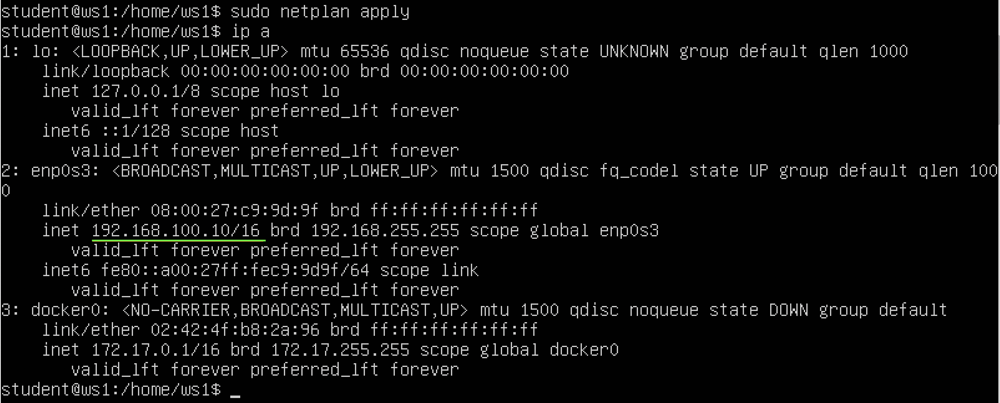
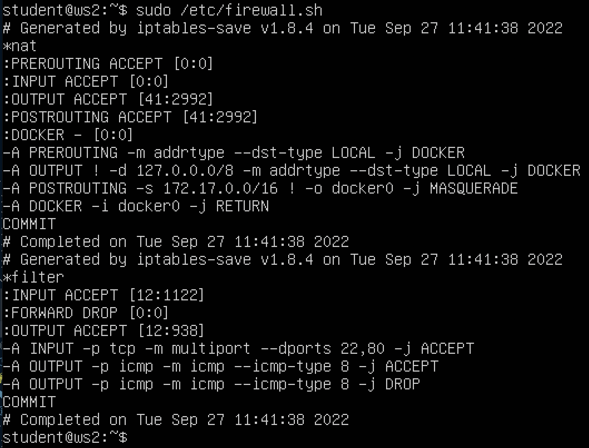
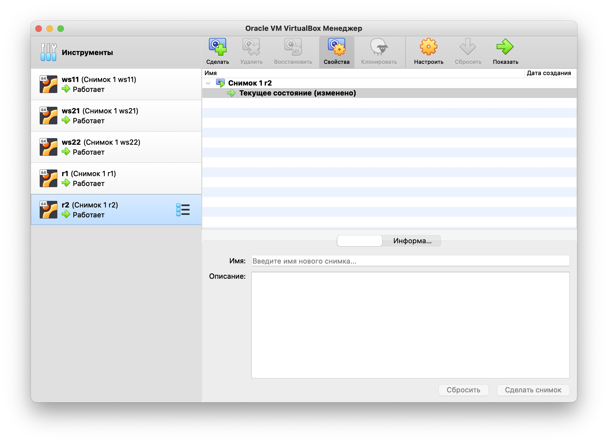
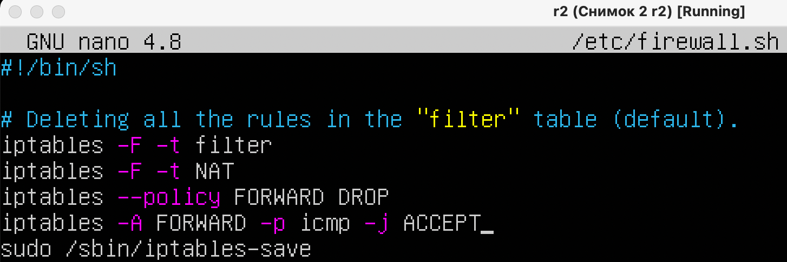
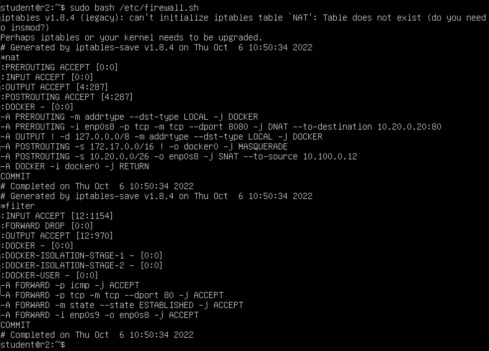

# D02 Linux Network

## Part 1. Инструмент ipcalc

### 1.1 Сети и маски

    Определить и записать в отчёт:

    1)Адрес сети 192.167.38.54/13

    2)Перевод маски 255.255.255.0 в префиксную и двоичную запись

.png)

    /15 в обычную и двоичную

.png)

    11111111.11111111.11111111.11110000 в обычную и префиксную

.png)

    3)Минимальный и максимальный хост в сети 12.167.38.4 при масках:

    /8

.png)

    11111111.11111111.00000000.00000000

.png)

    255.255.254.0

.png)

    /4

.png)

### 1.2 localhost

    Определить и записать в отчёт, можно ли обратиться к приложению, работающему на `localhost`, со следующими IP: 

    194.34.23.100

.png) нет

    127.0.0.2

.png) да

    127.1.0.1

.png) да

    128.0.0.1

.png) нет

### 1.3 Диапазоны и сегменты сетей

    Определить и записать в отчет:

    1)какие из перечисленных IP можно использовать в качестве публичного, а какие только в качестве частных:

    10.0.0.45

.png) частный

    134.43.0.2

.png) публичный

    192.168.4.2

.png) частный

    172.20.250.4

.png) частный

    172.0.2.1

.png) публичный

    192.172.0.1

.png) публичный

    172.68.0.2

.png) публичный

    172.16.255.255

.png) частный

    10.10.10.10

.png) частный

    192.169.168.1

.png) публичный

    2)какие из перечисленных IP адресов шлюза возможны у сети 10.10.0.0/18:

Возможные адреса попадают в диапазон между HostMin и HostMax

`10.0.0.1` невозможен

`10.10.0.2` возможен

`10.10.10.10` возможен

`10.10.100.1` невозможен

`10.10.1.255` возможен

---

## Part 2. Статическая маршрутизация между двумя машинами

    С помощью команды ip a посмотреть существующие сетевые интерфейсы

    Задать следующие адреса и маски: 
    ws1 - 192.168.100.10, маска /16 
    ws2 - 172.24.116.8, маска /12

Выполняем команду: `sudo nano /etc/netplan/00-installer-config.yaml` для каждой машины и задаем требуемые адреса и маски

    Выполнить команду: netplan apply для перезапуска сервиса сети

### 2.1 Добавление статического маршрута в ручную

    Добавить статический маршрут от одной машины до другой и обратно при помощи команды вида ip r add

    Пропинговать соединение между машинами

### 2.2 Добавление статического маршрута с сохранением

    Добавить статический маршрут от одной машины до другой с помощью файла etc/netplan/00-installer-config.yaml

    Пропинговать соединение между машинами

---

## Part 3. Утилита iperf3

### 3.1 Скорость соединения

    Перевести и записать в отчёт: 8 Mbps в MB/s, 100 MB/s в kbps, 1 Gbps в Mbps

Согласно открытому источнику:

> [8 Mbps = 1 MB/s](https://www.unitjuggler.com/перевод-bandwidth-из-Mbps-в-MBps.html?val=8) 

> [100 MB/s = 800 000 kbps](https://www.unitjuggler.com/перевод-bandwidth-из-MBps-в-kbps.html?val=100) 

> [1 Gbps = 1 000 Mbps](https://www.unitjuggler.com/перевод-bandwidth-из-Gbps-в-Mbps.html)

### 3.2 Утилита iperf3

    Измерить скорость соединения между ws1 и ws2

Устанавливаем утилиту `iperf3` на ВМ с помощью команды: `sudo apt install iperf3`. На `ws1` используем команду `iperf3 -s`, на `ws2` - `iperf3 -c 192.168.100.10`

---

## Part 4. Сетевой экран

### 4.1 Утилита iptables

    Создать файл /etc/firewall.sh, имитирующий фаерволл, на ws1 и ws2

    Нужно добавить в файл подряд следующие правила:

    1) на ws1 применить стратегию когда в начале пишется запрещающее правило, а в конце пишется разрешающее правило (это касается пунктов 4 и 5)

    2) на ws2 применить стратегию когда в начале пишется разрешающее правило, а в конце пишется запрещающее правило (это касается пунктов 4 и 5)

    3) открыть на машинах доступ для порта 22 (ssh) и порта 80 (http)

    4) запретить echo reply (машина не должна "пинговаться”, т.е. должна быть блокировка на OUTPUT)

    5) разрешить echo reply (машина должна "пинговаться")

    Запустить файлы на обеих машинах командами chmod +x /etc/firewall.sh и /etc/firewall.sh

На машине `ws1` в начале пишется запрещающее правило, а в конце пишется разрешающее правило следовательно она не сможет "пинговаться";

На машине `ws2` в начале пишется разрешающее правило, а в конце пишется запрещающее правило следовательно она сможет "пинговаться";

### 4.2 Утилита nmap

    Командой ping найти машину, которая не "пингуется"

    после чего утилитой nmap показать, что хост машины запущен (в выводе nmap должно быть сказано: Host is up)

 Устанавливаем утилиту `nmap` на `ws1` с помощью команды: `sudo apt install nmap`
 
 Далее выполняем команду: `sudo nmap 172.24.116.8`

    Сохранить дампы образов виртуальных машин

---

## Part 5. Статическая маршрутизация сети

### 5.1 Настройка адресов машин

    Настроить конфигурации машин в etc/netplan/00-installer-config.yaml согласно сети на рисунке

Выполняем команду: `sudo nano /etc/netplan/00-installer-config.yaml` для каждой машины и задаем требуемые адреса и маски

    Перезапустить сервис сети. Если ошибок нет, то командой ip -4 a проверить, что адрес машины задан верно

Выполняем команду: `netplan apply` для перезапуска сервиса сети, далее выполняем команду `ip -4 a` для проверки адресов машин

    Пропинговать ws22 с ws21

    Пропинговать r1 с ws11

### 5.2 Включение переадресации IP-адресов

    Для включения переадресации IP, выполните команду на роутерах: sysctl -w net.ipv4.ip_forward=1

    Откройте файл /etc/sysctl.conf и добавьте в него следующую строку: net.ipv4.ip_forward = 1

### 5.3 Установка маршрута по-умолчанию

    Настроить маршрут по-умолчанию (шлюз) для рабочих станций. Для этого добавить default перед IP роутера в файле конфигураций

    Вызвать ip r и показать, что добавился маршрут в таблицу маршрутизации

    Пропинговать с ws11 роутер r2 и показать на r2, что пинг доходит. Для этого использовать команду: tcpdump -tn -i enp0s9

### 5.4 Добавление статических маршрутов

    Добавить в роутеры r1 и r2 статические маршруты в файле конфигураций

    Вызвать ip r и показать таблицы с маршрутами на обоих роутерах

    Запустить команды на ws11: 
    ip r list 10.10.0.0/18 и 
    ip r list 0.0.0.0/0

    В отчёте объяснить, почему для адреса 10.10.0.0/18 был выбран маршрут, отличный от 0.0.0.0/0, хотя он попадает под маршрут по-умолчанию.

Для адреса `10.10.0.0/18` был выбран маршрут, отличный от `0.0.0.0/0` (он попадает под маршрут по-умолчанию), т.к. машина `ws11` соединена с сетью `10.10.0.0/18` по своему IP-адресу `10.10.0.2`, а для других адресов используется маршрут по умолчанию

### 5.5 Построение списка маршрутизаторов

    Запустить на r1 команду дампа: 
    tcpdump -tnv -i enp0s8

    При помощи утилиты traceroute построить список маршрутизаторов на пути от ws11 до ws21

Устанавливаем утилиту `traceroute` на `ws11` с помощью команды: `sudo apt install traceroute` далее `traceroute 10.20.0.10`

Вся информация в сети передается в виде пакетов. Поток данных разбивается специальным программным обеспечением на небольшие пакеты и передается через сеть на целевой узел, а там собирается обратно.

Каждый пакет проходит на своем пути определенное количество узлов, пока достигнет своей цели. Причем, каждый пакет имеет свое время жизни. Это количество узлов, которые может пройти пакет перед тем, как он будет уничтожен. Этот параметр записывается в заголовке TTL, каждый маршрутизатор, через который будет проходить пакет уменьшает его на единицу. При TTL=0 пакет уничтожается, а отправителю отсылается сообщение Time Exceeded.

Команда traceroute linux использует UDP пакеты. Она отправляет пакет с TTL=1 и смотрит адрес ответившего узла, дальше TTL=2, TTL=3 и так пока не достигнет цели. Каждый раз отправляется по три пакета и для каждого из них измеряется время прохождения. Пакет отправляется на случайный порт, который, скорее всего, не занят. Когда утилита traceroute получает сообщение от целевого узла о том, что порт недоступен трассировка считается завершенной.

### 5.6 Использование протокола ICMP при маршрутизации

    Запустить на r1 перехват сетевого трафика, проходящего через enp0s8 с помощью команды: 
    tcpdump -n -i eth0 icmp

    Пропинговать с ws11 несуществующий IP (например, 10.30.0.111) с помощью команды: 
    ping -c 1 10.30.0.111

    Сохранить дампы образов виртуальных машин

---

## Part 6. Динамическая настройка IP с помощью DHCP

    В данном задании используются виртуальные машины из Части 5

    Для r2 настроить в файле /etc/dhcp/dhcpd.conf конфигурацию службы DHCP:

Устанавливаем утилиту `isc-dhcp-server` на `r2` с помощью команды: `sudo apt install isc-dhcp-server`

    1) указать адрес маршрутизатора по-умолчанию, DNS-сервер и адрес внутренней сети

Открываем файл `sudo nano /etc/dhcp/dhcpd.conf`

Редактируем файл

    2) в файле resolv.conf прописать nameserver 8.8.8.8.

    Перезагрузить службу DHCP командой systemctl restart isc-dhcp-server

    Машину ws21 перезагрузить при помощи reboot и через ip a показать, что она получила адрес

    Также пропинговать ws22 с ws21.

    Указать MAC адрес у ws11, для этого в etc/netplan/00-installer-config.yaml надо добавить строки: macaddress: 10:10:10:10:10:BA, dhcp4: true

    Для r1 настроить аналогично r2, но сделать выдачу адресов с жесткой привязкой к MAC-адресу (ws11). Провести аналогичные тесты

    Запросить с ws21 обновление ip адреса

IP до обновления

IP после обновления

Удаляем старый IP

    какими опциями DHCP сервера пользовались в данном пункте

    Сохранить дампы образов виртуальных машин

---

## Part 7. NAT

    В данном задании используются виртуальные машины из Части 5

    В файле /etc/apache2/ports.conf на ws22 и r1 изменить строку Listen 80 на Listen 0.0.0.0:80, то есть сделать сервер Apache2 общедоступным

Устанавливаем утилиту `apache2` на `r1`, `r2` и `ws22` с помощью команды: `sudo apt install apache2`  
На `ws22` и `r1` изменяем строку `Listen 80` на `Listen 0.0.0.0:80`

    Запустить веб-сервер Apache командой service apache2 start на ws22 и r1

    Добавить в фаервол, созданный по аналогии с фаерволом из Части 4, на r2 следующие правила:

    1) Удаление правил в таблице filter - iptables -F
    2) Удаление правил в таблице "NAT" - iptables -F -t nat
    3) Отбрасывать все маршрутизируемые пакеты - iptables --policy FORWARD DROP

    Проверить соединение между ws22 и r1 командой ping

    При запуске файла с этими правилами, ws22 не должна "пинговаться" с r1

    Добавить в файл ещё одно правило:

    4) Разрешить маршрутизацию всех пакетов протокола ICMP

    Проверить соединение между ws22 и r1 командой ping

    При запуске файла с этими правилами, ws22 должна "пинговаться" с r1

    Добавить в файл ещё два правила:

    5) Включить SNAT, а именно маскирование всех локальных ip из локальной сети, находящейся за r2 (по обозначениям из Части 5 - сеть 10.20.0.0)
    6) Включить DNAT на 8080 порт машины r2 и добавить к веб-серверу Apache, запущенному на ws22, доступ извне сети

    Проверить соединение по TCP для SNAT, для этого с ws22 подключиться к серверу Apache на r1 командой:
    telnet 10.100.0.11 80

    Проверить соединение по TCP для DNAT, для этого с r1 подключиться к серверу Apache на ws22 командой telnet (обращаться по адресу r2 и порту 8080)

    Сохранить дампы образов виртуальных машин

---

## Part 8. Дополнительно. Знакомство с SSH Tunnels

    В данном задании используются виртуальные машины из Части 5

    Запустить веб-сервер Apache на ws22 только на localhost (то есть в файле /etc/apache2/ports.conf изменить строку Listen 80 на Listen localhost:80)

    Воспользоваться Local TCP forwarding с ws21 до ws22, чтобы получить доступ к веб-серверу на ws22 с ws21

    Воспользоваться Remote TCP forwarding c ws11 до ws22, чтобы получить доступ к веб-серверу на ws22 с ws11

В предыдущей части на роутере ` r2 ` был настроен на ` fireWall `, который не пропускает проходящие пакеты из другой сети. Поэтому сначала необходимо пробросить тунель от ` ws22 ` к ` ws11 `. Для этого запускаем на машине ` ws11 ` команду

    Для проверки, сработало ли подключение в обоих предыдущих пунктах, перейдите во второй терминал (например, клавишами option + fn + F2) и выполните команду:
    telnet 127.0.0.1 [локальный порт]

    Сохранить дампы образов виртуальных машин

---
